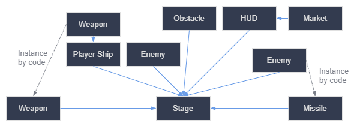

## Capítulo 2: <br>Primeros Pasos

---

# Índice de "Primeros Pasos"

<Toc text-sm columns="2" minDepth="1" maxDepth="2" mode="onlyCurrentTree"/>

---

### ¿Qué veremos hoy?

Este capítulo te ayudará a empezar a trabajar con el **editor** y el **motor**.

  * Nodos y escenas
  * Creación de instancias
  * Lenguajes de programación
  * Creación de tu primer script
  * Escuchar la entrada del jugador
  * Uso de señales

---

## Nodos y Escenas: Nodos

<div grid="~ cols-2 gap-4">
<div>

Los **nodos** son los bloques de construcción fundamentales de tu juego. Son como los ingredientes de una receta.

Todos los nodos tienen:

  * Un **nombre**.
  * **Propiedades** editables.
  * Reciben **devoluciones de llamadas** (callbacks).
  * Puedes **extenderlos** con nuevas propiedades y funciones.
  * Puedes **agregarlos** a otro nodo como hijo.

</div>

<div>


</div>

</div>

---

## Nodos y Escenas: Escenas

<div grid="~ cols-2 gap-4">
<div>

Cuando organizas **nodos** en un **árbol**, llamamos a esta construcción una **escena**.

Las escenas te permiten:

  * **Componer nodos** para crear tipos de nodos personalizados y complejos.
  * Guardarlas en tu disco y cargarlas más tarde.
  * Crear tantas **instancias** de una escena como desees.

</div>

<div>

</div>

</div>

---

## Creando tu primera escena

<div grid="~ cols-2 gap-4">
<div>

1.  En una escena vacía, haz clic en `Other Node` para agregar un nodo raíz.
2.  Busca y selecciona el nodo `Label`.
3.  El `Label` aparecerá en el editor y sus propiedades en el **Inspector**.

</div>

<div>

</div>

</div>

---

### Cambiar propiedades y ejecutar

<div grid="~ cols-2 gap-4">
<div>

1.  En el **Inspector**, cambia la propiedad `Text` a "Hola mundo".
2.  Usa la herramienta `Move` para centrar el texto.
3.  Presiona `F6` para ejecutar la escena. Se te pedirá que la guardes (ej: `label.tscn`).

¡Y listo! Verás "Hola mundo" en la ventana del juego.

</div>

<div>

</div>

</div>

---

## Creación de Instancias

<div grid="~ cols-2 gap-4">
<div>

Una vez guardada, una escena funciona como un **blueprint** (modelo). Replicar un objeto desde una plantilla se denomina **instancing**.

Cada instancia es una copia independiente. Puedes modificar cada una sin afectar a las demás.

</div>

<div>

</div>

</div>

---

### Instancias como lenguaje de diseño

<div grid="~ cols-2 gap-4">
<div>

Recomendamos estructurar tu código en torno a los elementos que los jugadores verán en tu juego.

En lugar de crear arquitecturas abstractas, puedes desglosar tu juego visualmente y crear una escena para cada componente.

</div>

<div>

</div>

</div>

---

## Lenguajes de Programación

Godot ofrece **cuatro lenguajes de programación** oficiales:

  * **GDScript**: Recomendado para principiantes. Creado por y para desarrolladores de juegos.
  * **C#**: Para quienes ya tienen experiencia. Madura y flexible.
  * **C / C++** (vía GDExtension): Para máximo rendimiento.

Puedes combinar lenguajes en un mismo proyecto.

---

## Creando tu primer script: `extends`

<div grid="~ cols-2 gap-4">
<div>

1.  Haz clic derecho en un nodo (`Sprite2D` en este caso) y selecciona `Attach Script`.
2.  Esto crea un archivo `.gd` que **extiende** la funcionalidad del nodo.

```gdscript
extends Sprite2D
```

La palabra clave `extends` significa que nuestro script hereda todas las propiedades y funciones del nodo `Sprite2D`.

</div>

<div>

</div>

</div>

---

### Moviendo el nodo: `_process(delta)`

La función `_process(delta)` se ejecuta en cada cuadro del juego. `delta` es el tiempo transcurrido desde el último cuadro.

```gdscript
extends Sprite2D

var speed = 400
var angular_speed = PI

func _process(delta):
  # Rota el sprite en cada cuadro
  rotation += angular_speed * delta

  # Calcula la dirección y mueve el sprite
  var velocity = Vector2.UP.rotated(rotation) * speed
  position += velocity * delta
```

---

## Escuchando la entrada del jugador

<div grid="~ cols-2 gap-4">
<div>

Para reaccionar a la entrada del jugador en cada cuadro, usamos el **singleton** `Input`.

El método `Input.is_action_pressed()` comprueba si una tecla está siendo presionada.

```gdscript
var direction = 0
if Input.is_action_pressed("ui_left"):
  direction = -1
if Input.is_action_pressed("ui_right"):
  direction = 1

rotation += angular_speed * direction * delta
```

</div>
<div>

</div>
</div>

---

## Uso de Señales

<div grid="~ cols-2 gap-4">
<div>

Las **señales** son mensajes que los nodos emiten cuando ocurre un evento (ej: un botón es presionado).

Otros nodos pueden conectarse a estas señales para reaccionar a dichos eventos.

Esto permite que los nodos se comuniquen sin estar directamente acoplados, manteniendo el código flexible.

</div>

<div>

</div>
</div>

---

### Conectando una Señal en el Editor

<div grid="~ cols-2 gap-4">
<div>

1.  Selecciona un nodo (ej: `Button`).
2.  Ve al panel **Node** (junto al Inspector).
3.  Haz doble clic en una señal (ej: `pressed`).
4.  Elige el nodo que recibirá la señal y el método que se ejecutará. Godot puede generar el método por ti.

</div>

<div>

</div>

</div>

---

### Código de la Señal

Godot creará una función de *callback* en el script del nodo receptor. El icono de conexión verde confirma el enlace.

```gdscript
func _on_button_pressed():
  # Este código se ejecuta cuando
  # se presiona el botón.
  set_process(not is_processing())
```

En este ejemplo, la función activa o desactiva el procesamiento del nodo, deteniendo o reanudando su movimiento.

---

### Señales personalizadas

También puedes definir tus propias señales para manejar eventos específicos de tu juego, como la muerte de un personaje o un cambio en su salud.

```gdscript
# Declara una nueva señal
signal health_depleted

func take_damage(amount):
  health -= amount
  if health <= 0:
    # Emite la señal
    health_depleted.emit()
```

---

## Resumen de conceptos

  * **Scripting**: Extiende la funcionalidad de los nodos. La función `_process(delta)` se ejecuta en cada cuadro.
  * **Input**: El singleton `Input` permite leer las acciones del jugador.
  * **Instancias**: Permiten reutilizar escenas como si fueran plantillas.
  * **Señales**: Un potente sistema para comunicar nodos de forma desacoplada. Puedes conectar señales desde el editor o por código.