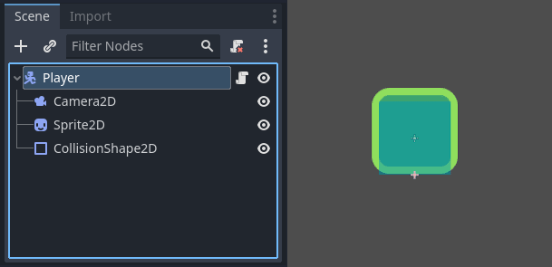
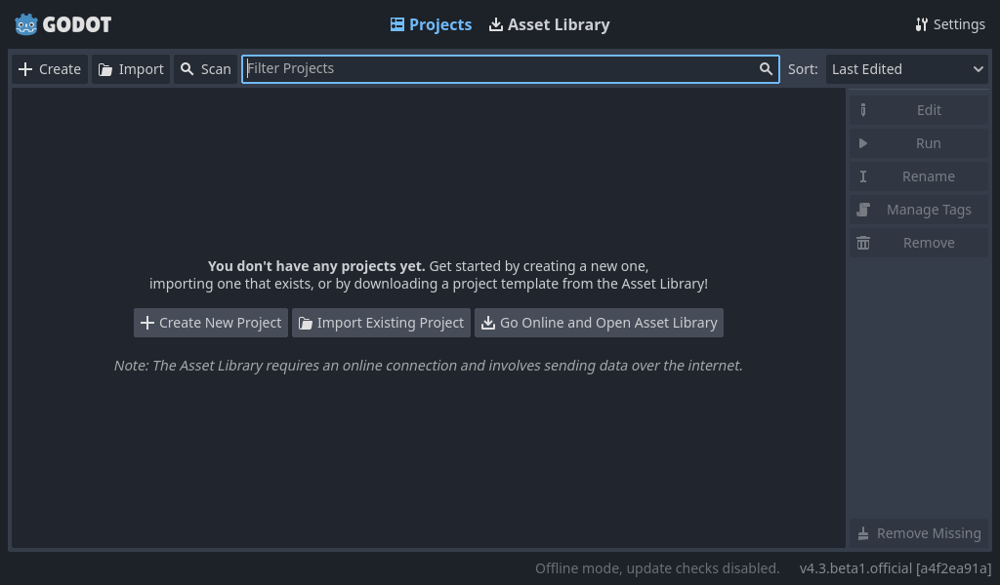
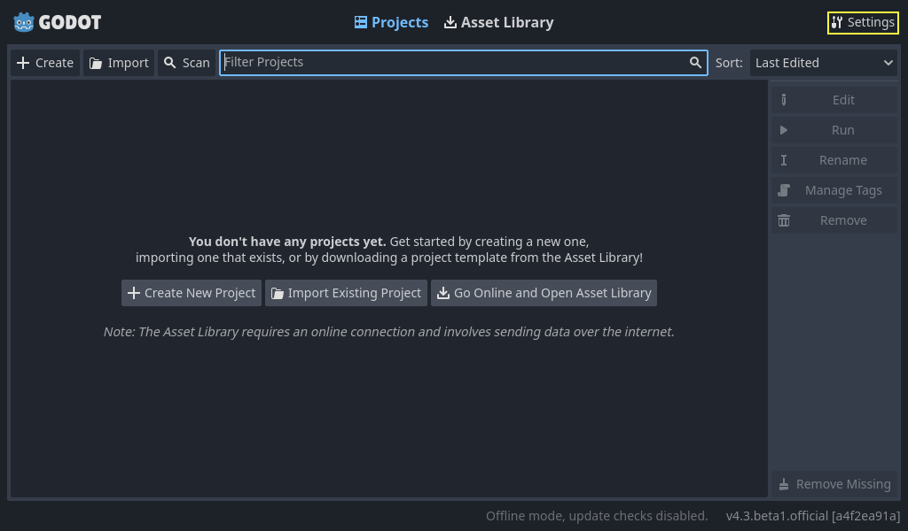
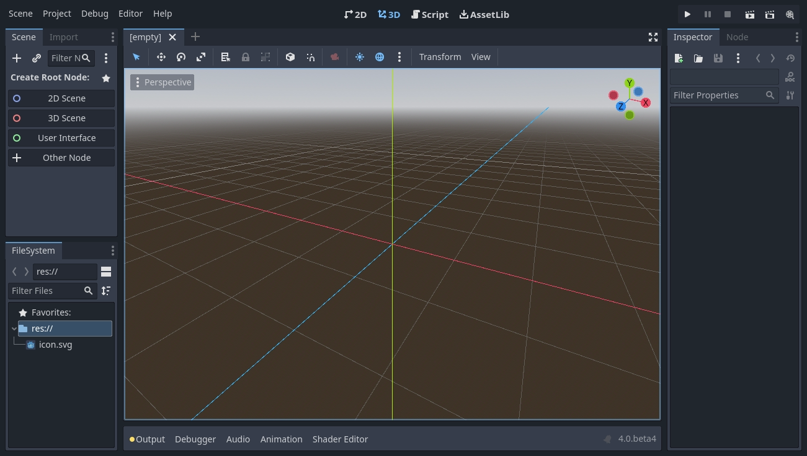
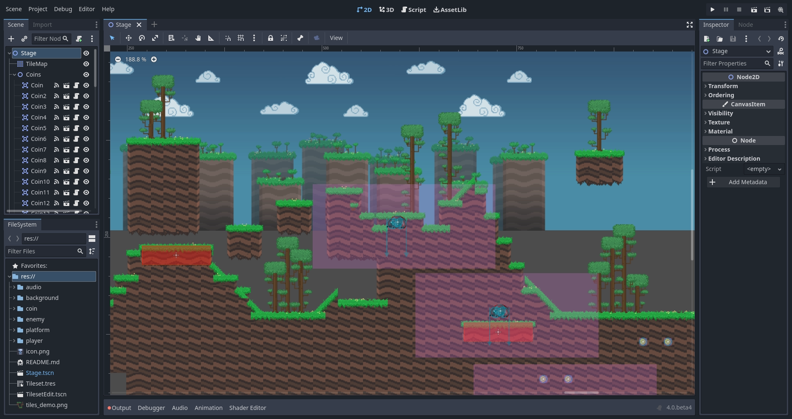
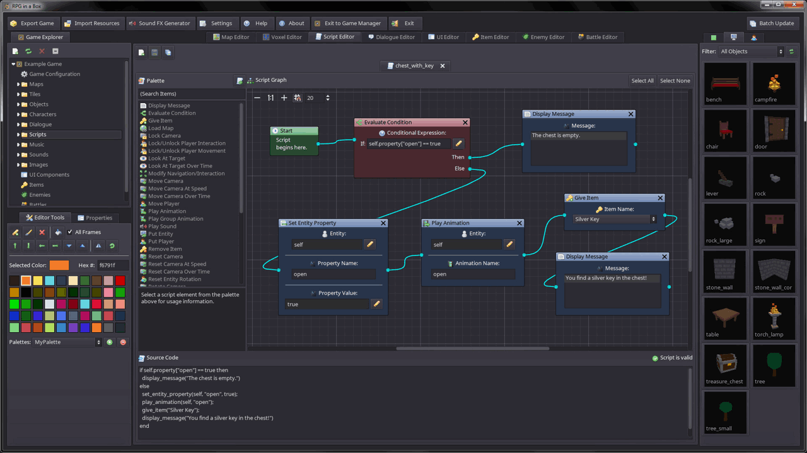
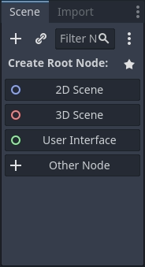
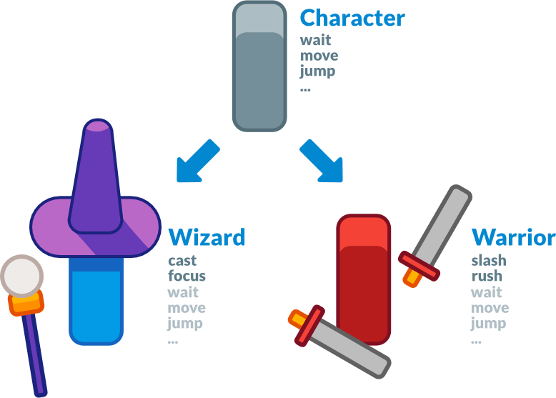
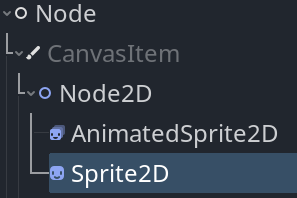
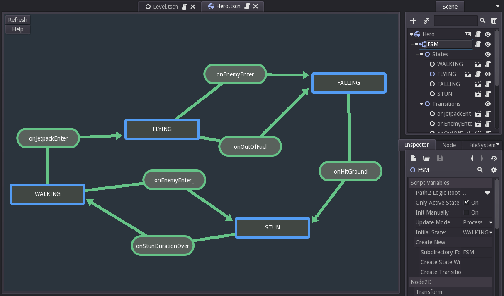

# Godot Engine

Clase 1: Introducción

---

# El motor de juegos de Godot

Godot puede crear tanto **juegos** como **aplicaciones** en:

* Desktop
* Mobile
* Web
* Consolas (requiere alto nivel de programación y estándares internacionales)

---

# Juegos / apps creados con Godot

Algunos ejemplos notables:

* Ex-Zodiac
* Helms of Fury
* Pixelorama

---

# Ex-Zodiac

<Youtube id="KIsGnOXHoZM?start=23" width=400 height=300 />

---

# Helms of Fury

<Youtube id="az6nKawmybY" width=400 height=300 />

---

# Pixelorama

<Youtube id="--ZcztkvWUQ" width=400 height=300 />

---

# El editor de Godot incluye

* Editor de código
* Editor de animación
* Editor de tilemap
* Editor de shader
* Debugger
* Profiler
* ...y mucho más.

---

# Conceptos clave de Godot

* **Juego** = árbol de escenas
* **Escena** = árbol de nodos
* **Nodos** = bloques de construcción
* **Señales** = mensajes de comunicación flexible entre nodos

---

# Escenas

Una escena puede ser muchas cosas:

* Personaje
* Arma
* Menú de UI
* Casa
* Nivel completo

---

# Nodos

El personaje **Player** incluye:

* `CharacterBody2D` (Player)
  * `Camera2D`
  * `Sprite2D`
  * `CollisionShape2D`

---

# Árbol de Escena

Todas las escenas de tu juego se reúnen en el ***árbol de escena***. Y cada escena es un árbol de nodos.

---

# Señales

Hay nodos que pueden emitir **señales** cuando ocurre un evento, y otros que pueden recibirlas. Estas señales no son más que mensajes que pueden ser enviados y recibidos entre nodos.

Ejemplo: Un botón emite una señal cuando es presionado.

---

# Resumen de conceptos

* **Nodos** = bloques básicos
* **Escenas** = combinaciones de nodos
* **Árbol de escena** = todas las escenas unidas
* **Señales** = mensajes de comunicación de eventos entre nodos

---

# Primer vistazo: Project Manager

**Project Manager** permite:

* Administrar proyectos existentes
* Importar o crear nuevos
* Acceso a **Asset Library**

---

# Asset Library

Proyectos de demostración y recursos abiertos desarrollados por la comunidad.

---

# Configuración del Project Manager

* Idioma del editor
* Tema de interfaz
* Escala de visualización
* Convención de nombres

---

# Interfaz del Editor

Secciones principales:

- Menú superior
- Ventana gráfica (viewport)
- Pestañas de escenas
- Herramientas (toolbars)
- Paneles acoplables (docks)
- Panel inferior (bottom panel)

---

# Las cuatro pantallas principales

* 2D: juegos e interfaces
* 3D: niveles, luces, meshes
* Script: editor de código
* Asset Library: recursos y plugins

---

# El editor Godot, es un juego Godot

* El propio editor está hecho en Godot
* Puedes usar `@tool` para ejecutar scripts en el editor
* Permite crear plugins y extensiones
  * Ejemplo: **RPG in a Box**

---

# Motores 2D y 3D

* Motor **2D** y motor **3D** independientes
* Unidad base en 2D = píxeles
* Puedes mezclar 2D y 3D en el mismo juego (2.5D).

---

# Paneles acoplables (docks)

A ambos lados de la *Ventana gráfica* se puede acceder a los paneles acoplables:

* **Scene** → nodos de la escena activa
* **FileSystem** → archivos del proyecto
* **Inspector** → propiedades del nodo seleccionado

Ejemplo: Scene Dock

---

# Panel inferior (bottom panel)

* Consola de depuración
* Editor de animación
* Mezclador de audio
* ... y más herramientas.

---

# Referencia de clases integrada

Atajos:

* `F1`
* Botón **Search Help**
* Menú **Help → Search Help**
* `Ctrl + clic` sobre clases o funciones

---

# Profundicemos sobre la filosofía de diseño de Godot

* **Orientado a objetos**
* **Sistema de escenas flexible**
* **Jerarquía de nodos**
* Composición y **herencia de escenas**

---

# Escenas y herencia

Una escena puede extender otra, como:

`Wizard` → extiende `Character`

---

# Nodos en Godot

Todos los nodos heredan de `Node`:

`Node` → `CanvasItem` → `Node2D` → `Sprite2D`

---

# Paquete todo-incluido

- **Workspace de scripting:** editor de código integrado.
- **Editor de animación:** herramienta para crear animaciones complejas para personajes.
- **Editor de tilemap:** interfaz visual para construir niveles 2D usando una grilla de mosaicos o "tiles".
- **Editor de shaders:** espacio de trabajopara programar efectos visuales y materiales personalizados que corren en una tarjeta gráfica dedicada.
- **Debugger:** herramienta auxiliar para inspeccionar variables y encontrar errores en tu código.
- **Profiler:** analizador que mide el rendimiento del juego para identificar y optimizar las partes que lo vuelven lento.
- **Hot-reload:** función que actualiza instantáneamente los cambios en tu código y escenas en el juego en ejecución, sin necesidad de reiniciarlo.

---

# Lenguajes soportados

* **GDScript** (integrado en el motor)
* **C#**
* Con `GDExtension`: C, C++, Rust, D, Haxe, Swift

---

# Plugins y extensibilidad

Ejemplo: **State Machine Editor**

---
